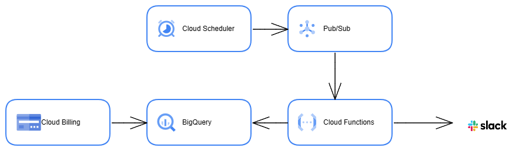

# プロジェクトごとの GCP の請求金額を週次で Slack に通知する

## 

---

### ①Cloud Billing データを BigQuery にエクスポート

1. 対象プロジェクトの Billing 画面で「課金データのエクスポート」設定を行う
2. 必要情報を入力し「データセットを作成」をクリック
3. BigQuery 画面の対象プロジェクト配下にエクスポートしたデータセットが作成される（データがエクスポートされるまでに時間がかかるため翌日にチェック）

---

### ② Pub/Sub トピックの作成

1. Pub/Sub トピックを新規作成する

   名前：weekly_cost_notification

---

### ③ Cloud Functions を定期実行するよう Cloud Scheduler を設定

1. Cloud Scheduler 画面から「ジョブを作成」する

   説明：GCP 利用料金通知

   頻度：Cron 式で入力

   ターゲット：Pub/Sub

   トピック：weekly_cost_notification

   ペイロード：cost-calculation

---

### ④ Slack のチャネルを設定

1. 通知を飛ばすチャネルを作成する

   - 名前：gcp-billing
   - 説明：GCP コスト監視

2. Incoming Webhook の追加

   - 通知先チャンネルから「アプリを追加する」を選択
   - Incoming Webhook を検索し追加する

3. 投稿先のチャンネルを選択し、「incomming Webhook インテグレーションの追加」を選択
4. 作成された Webhook URL をメモする（投稿時のアイコンなども設定できるので、必要に応じて設定）

---

### ⑤ Cloud Functions の作成

1. Pub/Sub トピック画面に遷移し、Pub/Sub からトリガーする Cloud Functions を新規作成する（「Cloud Functions の関数をトリガー」を押下）
2. BigQuery にエクスポートされた Billing データテーブルから、プロジェクトの月ごとの課金情報を取得
3. config.yaml：

   - Incoming Webhook の設定で取得した Webhook URL を記載
   - .gitignore に記載し、git 管理対象外にする

4. post_slack：

   - BigQuery クライアントライブラリを利用して BigQuery クライアントを取得
   - Slack 通知内容の作成と通知

5. get_monthly_cost_date_range：

   - 対象月のコスト算出対象の初日と当日の日付を取得する

6. requirements.txt に下記を記載する

   ```
   google-cloud-bigquery==3.5.0
   functions-framework==3.0.0
   requests==2.*
   ```

<参考 URL>
[Slack の設定](https://dev.classmethod.jp/articles/notify-slack-aws-billing/)

---

<参考資料>

[Pub/Sub を使用して Cloud ファンクションをトリガーする](https://cloud.google.com/scheduler/docs/tut-pub-sub?hl=ja)

[GCP のコスト情報を Teams で通知する方法](https://cloud.bigtreetc.com/column/gcp_daily_cost_notification_teams/)

[GCP 利用料金を bot で Slack に通知してみた](https://dev.classmethod.jp/articles/gcp-cost-slack-bot-notify/)
